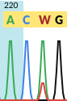
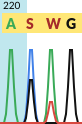

# HyraxBio AB1 parser, writer and generator (beta 0.2)

This project contains

 - Modules for parsing, generating or manipulating AB1 files.
 - Support for generating a minimal AB1 file from a FASTA input file
 - A simple terminal app to perform these operations

See

  - https://hackage.haskell.org/package/hyraxAbif for the hackage documentation
  - http://www6.appliedbiosystems.com/support/software_community/ABIF_File_Format.pdf for a high level overview of the AB1 file format.

# Building

Build with one of

 - `stack build` or (`make build`)
 - `cabal new-build`


# Terminal app

Run with

 - `stack exec hyraxAbif-exe -- -- dump` if you are using stack
 - `cabal new-run hyraxAbif-exe dump` if you are using cabal 2.x

## Dump AB1

To dump an existing AB1 run

 `hyraxAbif-exe dump example.ab1`

This will output the structure of the AB1 like this

```
Header { hName = "ABIF" , hVersion = 101 }
Directory
  { dTagName = "tdir"
  , dTagNum = 1
  , dElemTypeCode = 1023
  , dElemTypeDesc = "root"
  , dElemType = ElemRoot
  , dElemSize = 28
  , dElemNum = 13
  , dDataSize = 364
  , dDataOffset = 61980
  , dData = ""
  , dDataDebug = []
  }
[ Directory
    { dTagName = "DATA"
    , dTagNum = 9
    , dElemTypeCode = 4
    , dElemTypeDesc = "short"
    , dElemType = ElemShort
    , dElemSize = 2
    , dElemNum = 7440
    , dDataSize = 14880
    , dDataOffset = 128
    , dData = ""
    , dDataDebug = []
    }
    
.
.
.

DATA {short} tagNum=9 size=2 count=7440 offset=128  []
DATA {short} tagNum=10 size=2 count=7440 offset=15008  []
DATA {short} tagNum=11 size=2 count=7440 offset=29888  []
DATA {short} tagNum=12 size=2 count=7440 offset=44768  []
FWO_ {char} tagNum=1 size=1 count=4 offset=1195463747  ["GATC"]
LANE {short} tagNum=1 size=2 count=1 offset=65536  ["1"]
PBAS {char} tagNum=1 size=1 count=744 offset=59648  ["GGGGGCAACTAAAGGAAGCTCTATTAGATACAGGAGCAGATGATACAGTATTAGAAGAAATGAGTTTGCCAGGAAGATGGAAACCAAAAATGATAGGGGGAATTGGAGGTTTTATCAAAGTAAGACAGTATGATCAGATACTCATAGAAATCTGTGGACATAAAGCTATAGGTACAGTATTAGTAGGACCTACACCTGTCAACATAATTGGAAGAAATCTGTTGACTCAGATTGGTTGCACTTTAAATTTTCCCATTAGCCCTATTGAGACTGTACCAGTAAAATTAAAGCCAGGAATGGATGGCCCAAAAGTTAAACAATGGCCATTGACAGAAGAAAAAATAAAAGCATTAGTAGAAATTTGTACAGAGATGGAAAAGGAAGGGAAAATTTCAAAAATTGGGCCTGAAAATCCATACAATACTCCAGTATTTGCCATAAAGAAAAAAGACAGTACTAAATGGAGAAAATTAGTAGATTTCAGAGAACTTAATAAGAGAACTCAAGACTTCTGGGAAGTTCAATTAGGAATACCACATCCCGCAGGGTTAAAAAAGAAAAAATCAGTAACAGTACTGGATGTGGGTGATGCATATTTTTCAGTTCCCTTAGATGAAGACTTCAGGAAGTATACTGCATTTACCATACCTAGTATAAACAATGAGACACCAGGGATTAGATATCAGTACAATGTGCTTCCACAGGGATGGAAAGGATCACCAGCAATATTCCAAAGTAGCATGA"]
PDMF {pString} tagNum=1 size=1 count=23 offset=60392  ["KB_3500_POP7_BDTv3.mob"]
PDMF {pString} tagNum=2 size=1 count=23 offset=60415  ["KB_3500_POP7_BDTv3.mob"]
PLOC {short} tagNum=1 size=2 count=744 offset=60438  []
S/N% {short} tagNum=1 size=2 count=4 offset=61926  []
SMPL {pString} tagNum=1 size=1 count=10 offset=61934  ["S17-SeqF1"]
CMNT {pString} tagNum=1 size=1 count=1 offset=61944  ["Generated by HyraxBio AB1 generator"]
```

The data is output twice. The first section is the detail, the second is the summary.

Selected data types have the "debug data" element populated. e.g. the PBAS (FASTA)

## Generate minimal AB1s from FASTAs

To create an AB1 run

 `hyraxAbif-exe gen "./pathContainingFastas" "./pathForOutputAb1s"`

This will create an AB1 per input FASTA

### Input FASTA format

Each input data should have the following format

```
> weight
read
> weight
read
```

 - The **weight** is a numeric value between 0 and 1 that specifies the weight of the current read. No other header/name is allowed

 - The **read** is the set of input nucleotides, IUPAC ambiguity codes are supported (MRWSYKVHDBNX). A read can be single or multi-line


### Weighted reads

 - The weigh of a read specifies the intensity of the peak from 0 to 1. 
 - Weights for each position are added to a maximum of 1 per nucleotide
 - You can use `_` as a "blank" nucleotide, in which only the nucleotides from other reads will be considered


For example


  ```
  > 0.5
  ACG
  > 0.3
  AAAA
  > 1
  __AC
  ```
Results in the following weighted nucleotide per position

 * 0: `A` (0.5 + 0.3)
 * 1: `C` (0.5), `A` (0.3)
 * 2: `G` (0.5), `A` (0.3 + 1 = 1)
 * 3: `A` (0.3), `C` (1)


*Note that the reads do not need to be the same length.*


### Reverse reads

A weighted FASTA can represent a reverse read. To do this add a `R` suffix to the weight.
The data you enter should be entered as if it was a forward read. This data will be complemented
and reversed before writing to the ABIF


---

#### Example FASTA - single file

***eg1.fasta***
```
> 1
ACTG
```


Here there is a single FASTA with a single read with a weigh of 1 (100%). The chromatogram for this AB1 shows perfect traces for the input `ACTG` nucleotides

---

#### Example FASTA - two FASTA files

***eg1.fasta***
```
> 1
ACAG
```

***eg2.fasta***
```
> 1
ACTG
```


Two input FASTA files both with a weigh of 1. You can see in the second trace that the third nucleotide is a `T` (the trace is green). Exactly what the base-calling software (phred & recall etc) decide to call the base as depends on your settings and software choices.

---

#### Example FASTA - two FASTA files with different weights

***eg1.fasta***
```
> 1
ACAG
```

***eg2.fasta***
```
> 0.3
ACTG
```


Here the second fasta has a weight of 0.3 and you can see the traces are 30% of the height of the top ones.


---

#### Example FASTA - single FASTA with a mix

***eg1.fasta***
```
> 1
ACAG
> 0.3
ACTG
```



The single input FASTA has an `AT` mix at the third nucleotide. The first read has a weight of 1 and the second a weight of 0.3.
Notice that the maximum weight is 1, e.g. the first `A` has the same intensity as the second even though the first one has the reads weighted both 1 and 0.3

---


#### Example FASTA - Multiple mixes

***eg1.fasta***
```
> 1
ACAG
> 0.3
_GT
> 0.2
_G
```



---

# Using the modules

 - Hyrax.Abif: The core AB1 types
 - Hyrax.Abif.Fasta: A simple FASTA parser used when generating AB1s
 - Hyrax.Abif.Read: Module for parsing an existing AB1
 - Hyrax.Abif.Write: Module for writing a new AB1 file
 - Hyrax.Abif.Generate: Module for generating a minimal AB1 from a given FASTA input

For a detailed overview of the code see *TODO* and the haddock documentation *TODO*

For now the terminal app (Main.hs) serves as an example and the best starting point to understand the code


## E.g. Add a comment to an existing AB1 file


```
import qualified Hyrax.Abif as H
import qualified Hyrax.Abif.Read as H
import qualified Hyrax.Abif.Write as H

addComment :: IO ()
addComment = do
  abif' <- H.readAbif "example.ab1"

  case abif' of
    Left e -> putText $ "error reading ABIF: " <> e
    Right abif -> do
      let modified = H.addDirectory abif $ H.mkComment "new comment"
      H.writeAbif "example.modified.ab1" modified
```

For additional examples see the Examples directory
